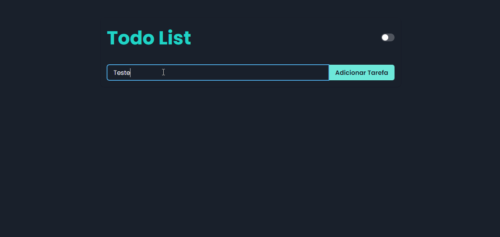

# Todo List - Chakra UI

Aplicação simples de estudo realizada com o fim de praticar TypeScript, ReactJS Hooks e Chakra UI.

##  ✨ Preview

## 🛠 Builded with

##  About me

- 👤 Bacharel em jornalismo se aventurando pelo mundo da programação, estudando stacks relacionadas ao front-end, focado em ReactJS

- 🔭 Me encontre:  
